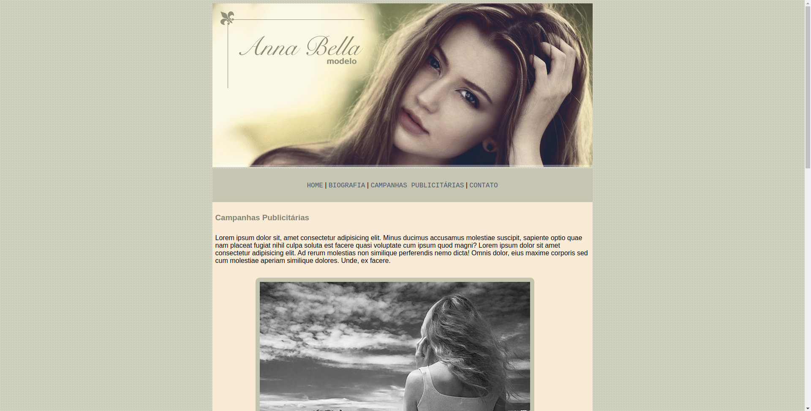
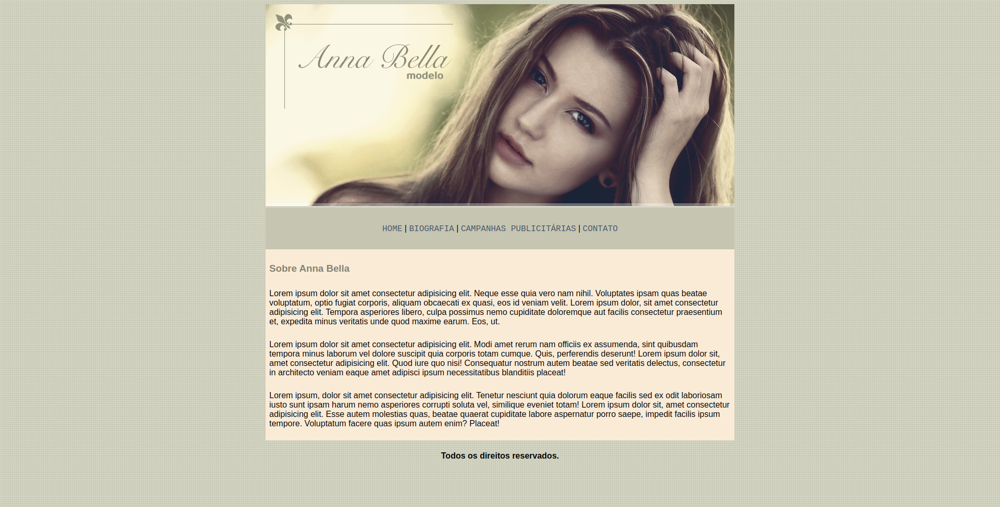

# EstudoCSS-proj-Modelo
Projeto que simula um website de divulgação de uma modelo fictícia com variaçãs seções ,tais como : Home, campanhas publicitárias, biografia e contato.
  
*Seção Home* :
  

*Seção campanhas publicitárias* :
 

  
Tecnologias utilizadas: 
 HTML
 CSS
  
Para ver o projeto funcionado clique [AQUI](https://wilgnerfrasao.github.io/EstudoCSS-proj-Modelo/)

